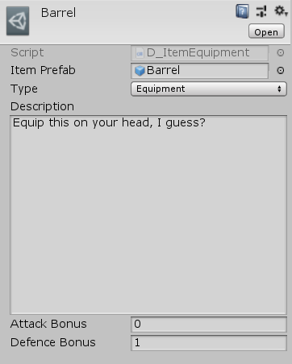
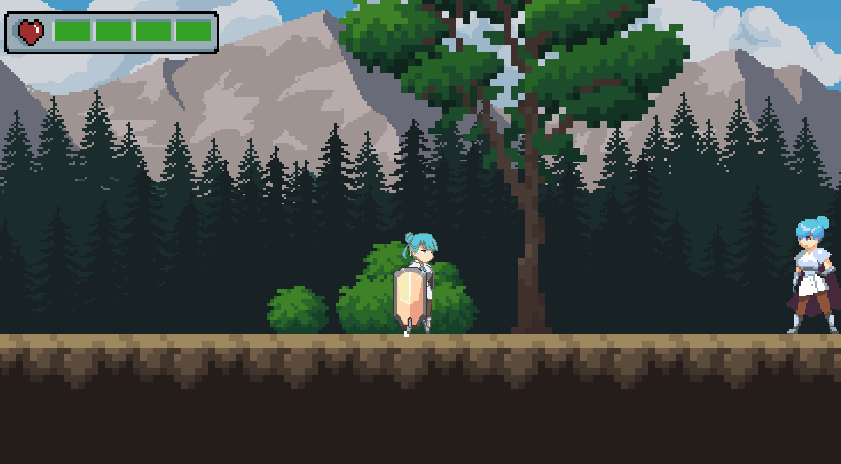

# Project AS
### A 2d Platformer with combat, enemy AI, inventory systems, and much more!
Click [here](https://youtu.be/Dpq2fNdg7B4?si=yII7AgSRjjToQ83L) to see the Game Devlog video I made for this!

## Table of Contents

> 1. [Introduction](#introduction)
> 2. [Management](#management)
> 3. [Project Structure](#structure)
> 4. [AI](#ai)
> 5. [Inventory system](#inventory)
> 6. [Water simulation](#water)

## 1. Introduction

This is a WIP game that I worked on for about a month in the summer.
The main idea was to make a 2D RPG platformer focused on exploration. This means:
- Complicated and interesting enemy/companion AI
- Dialog system
- Quest system

We will cover these down below.

## 2. Management
As the project was of a small scope, our GDD didn't get out of draft ([Link to GDD](https://docs.google.com/document/d/1_8kaoToZ47eohzl06_2CHcwF1LyTreOwdAag0YUb16U/edit?usp=sharing))
As for tasks, I used Trello as it was simple to use and was very similar to GitHub project boards. ([Link to my Trello](https://trello.com/b/9wqa2udz/project-as))

## 3. Project Structure
General structure of the project is straight-forward: 
<pre>
Assets
    Audio            // Contains audio manager
          Cameras
          Entities   // For NPCs, Enemies, and players 
          FX
          Items      // For the inventory system
          UI
    Prefabs
          Managers
          UI
    Resources        // Keeps mostly data (Scriptable Objects / Models)
          Dialogue
          Items
    Scenes
    Scripts
          Editor      // Script for development tools I made
          Game        // Mainly contains Controllers
          NPC         // Everything related to AI and State Machines
          Player
    Sprites
</pre>

## 4. AI
(visual results down below)
We have 2 main scripts for making the State machine work:
1. **FiniteStateMachine.cs**: Simple state holder that switches between states.
2. **State.cs**: Actual state of a specific behavior

The `State` class is an abstract class. Many new classes will inherit from it to define their own behaviors.
Here are some examples:

### Skeleton

The skeleton Enemy npc has many states. One of which is `Skeleton_MeleeAttackState.cs`
It overrides the base functions that can be utilized easily from everywhere without having to worry about the underlying complexities of the Skeleton class.

### Companion

This NPC is a companion. After interacting with the companion via `E` key, it follows the player. If the player attacks an enemy, it will attack the same enemy until it dies.

### Multi-staged behavior

This enemy (a boss fight) has multiple stages to its behavior.
In stage 1, it attacks with melee (punch, kick) and runs/dash in a slow interval.
In stage 2 (when his HP gets to half), it uses its sword and starts dashing a lot more.

## 5. Inventory
The inventory system was made to be flexible and scalable.
Here's a general idea of how it works:
- An `Item.cs` class is used for all items, which allows the inventory to work on an abstraction layer without being tightly coupled.
- Each item has its own category, such as Equipment (for damage or health boost), Food (eat to regain health), etc.
- All managed in the editor as a dev tool:
- 
  

The dialog system is also very similar, as it's basically many data nodes connected to each other (AKA a Tree)

## 6. Water Simulation
A fun thing I wanted to add was water. This would make for greate water sections where the player could swim and swing (has nice tone to it!)
I was inspired by what Super Mario Bros. did in their platformers:

The main idea behind recreating this is to Fake it 'til you make it! Using mainly [Hooke's law](https://en.wikipedia.org/wiki/Hooke's_law) and [euler methods](https://en.wikipedia.org/wiki/Euler_method) (for the surface of the water, since we're basically working with connected dots).
Here's a [link](https://code.tutsplus.com/make-a-splash-with-dynamic-2d-water-effects--gamedev-236t) to an article by Michael Hoffman that explains how to do it.

